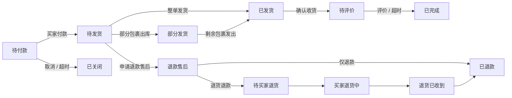

# 掌中宝交易 OMS 项目介绍网站文案

> 适用场景：个人作品集网站 / 面试作品集 / 大厂 P7 级产品经理项目介绍
> 文案定位：从“偏设计展示”升级为“业务战略 + 复杂系统设计 + 增长商业化 + 组织协同”的产品案例
> 参考结构：采用海外 B2B SaaS 产品案例常见的「Product Overview / Ownership / Market Opportunity / Personas & Use Cases / Solution Footprint / Impact / Learnings」叙事方式，同时适配中文面试与作品集表达。

---

## 01. Hero Section｜项目首屏

### 页面主标题

# 掌中宝交易 OMS
## 面向淘宝 / 天猫中小商家的轻量化订单管理 SaaS

### 一句话定位

掌中宝交易是一款面向淘宝、天猫中小商家的第三方订单管理系统，帮助商家在千牛生态内完成订单同步、订单处理、打单发货、拆合单、物流回传、售后协同与自动化履约，提升高频订单履约效率，并形成从免费获客到分层付费的商业化闭环。

### 核心标签

`B2B SaaS` `OMS` `电商交易` `千牛服务市场` `订单履约` `商业化增长` `复杂业务系统` `移动优先`

### 关键成果

| 指标 | 结果 |
|---|---:|
| 用户规模 | 60W+ |
| 付费用户 | 7.3W+ |
| 付费转化率 | 12% |
| 续费率 | 65% |
| 产品线贡献 | 占公司核心业务营收约 30% |
| 冷启动验证 | 上线 1 个月用户突破 1W |
| 核心链路优化 | 搜单 / 打单效率提升约 50% |
| 体验与转化 | 用户满意度提升约 60%，付费转化提升约 10% |

### 首屏右侧文字建议

**My Role**
产品负责人 / 核心创始成员，负责掌中宝交易从 0-1 产品定义、MVP 验证、核心链路优化、差异化机会挖掘、商业化体系构建与团队协同推进。

**Scope**
覆盖订单同步、订单状态机、搜索筛选、订单列表、打单发货、拆单合单、售后退款、虚拟商品自动发货、移动端体验、多端设计规范与分层付费策略。

**Team**
管理产品与设计团队，协同 10+ 研发资源，在多业务线并行情况下完成版本规划、优先级决策、方案评审与落地推进。

### 首屏配图建议

左侧使用项目主视觉或订单管理界面大图；右侧使用指标卡片与角色说明。
可在首屏下方放置「ER 图 / 泳道图」缩略入口，作为复杂业务系统能力的证据。

---

## 02. Product Overview｜项目背景与产品概览

掌中宝交易诞生于淘宝 / 天猫商家订单管理场景。对中小商家而言，订单管理不是低频后台功能，而是每天高频发生的经营主链路：看单、找单、核单、打单、发货、处理售后、通知买家、核对物流、做自动化运营。

在项目早期，我观察到市场存在明显断层：

一类是重 ERP / 重 OMS 系统，能力完整，但实施成本高、学习成本高、价格门槛高，并不适合大量中小商家快速上手；另一类是平台基础工具或轻量打单工具，操作简单，但在复杂订单处理、多物流、多售后、多店铺、多包裹等场景下能力不足。

因此，掌中宝交易的核心定位不是做“大而全 ERP”，而是做一款**轻量化、高效率、移动优先的订单管理 SaaS 工具**。产品从商家最高频、最刚需、最容易形成付费意愿的履约链路切入，优先解决订单处理效率，再逐步延展到自动化能力、差异化场景和商业化体系。

### 可用于网站右侧介绍的短文案

**掌中宝交易并不是一个单纯的订单列表工具，而是围绕商家履约链路建立的一套轻量 OMS。**

它把平台订单、交易主单、履约单 / 包裹单、拣货单、发货单、售后单、库存流水、物流回传和退款闭环串联起来，让中小商家在一个低学习成本的工具里完成日常订单处理，同时保留足够的业务深度来支持复杂经营场景。

---

## 03. Ownership｜我的角色与职责

### 角色定位

我在项目中承担产品负责人角色，是掌中宝交易的核心创始成员之一，覆盖从 0-1 到规模化增长的完整生命周期。

### 负责范围

1. **产品战略与定位**
   判断市场断层，定义“轻量化、高效率、移动优先”的产品战略，明确不与重 ERP 正面对抗，而是聚焦中小商家高频履约场景。

2. **0-1 MVP 验证**
   主导基础订单管理能力上线，包括订单同步、订单列表、搜索筛选、状态管理、批量处理、打单发货与基础售后协同，并完成早期用户冷启动。

3. **复杂业务系统设计**
   梳理订单状态机、单据流转关系、履约与售后分支，推动平台订单、OMS 主单、包裹单、拣货单、发货单、库存流水和退款单之间的业务关系清晰落地。

4. **核心链路体验优化**
   基于用户调研、客服反馈、数据打点和竞品分析，重构搜索筛选、订单列表、批量操作、打单发货、拆单合单等关键链路。

5. **差异化机会挖掘**
   在平台免费化与竞品同质化压力下，识别虚拟商品自动发货等细分高价值场景，推动产品能力建设，形成新的付费增长点。

6. **商业化体系构建**
   设计免费版、黄金版、白金版的功能分层与付费策略，围绕效率工具、自动化能力、高阶功能和差异化能力构建付费点。

7. **团队与跨部门协同**
   管理产品与设计团队，协调研发、客服、运营、平台接口资源，完成多版本并行推进、优先级决策和落地验收。

### P7 级表达重点

这个项目体现的不是单点功能设计，而是四类能力的组合：

- **业务抽象能力**：把复杂电商履约链路抽象为可维护的状态机与单据模型。
- **产品策略能力**：在平台、竞品、用户需求三方变化中找到产品定位和差异化空间。
- **增长商业化能力**：从 MVP 验证到规模化获客，再到分层付费和续费留存。
- **组织推进能力**：在多角色、多系统、多团队协同下推动方案落地。

---

## 04. Market Opportunity｜市场机会与业务判断

### 业务背景

淘宝 / 天猫商家在订单管理上有两个典型矛盾：

第一，订单处理是高频刚需。只要商家每天有订单，就需要处理订单同步、核单、发货、物流回传和售后问题。

第二，中小商家的系统预算、学习成本和管理复杂度承受能力有限。他们不一定需要完整 ERP，但需要比平台基础工具更高效、更贴近经营场景的订单处理能力。

### 市场断层

| 类型 | 优势 | 问题 | 掌中宝交易机会 |
|---|---|---|---|
| 重 ERP / 重 OMS | 能力完整，适合复杂企业 | 成本高、上手重、实施周期长 | 中小商家不一定愿意承担 |
| 平台基础工具 | 免费、低门槛 | 业务深度不足，差异化弱 | 很难覆盖复杂订单与自动化需求 |
| 轻量打单工具 | 单点效率高 | 容易同质化，缺少系统闭环 | 可升级为轻量 OMS |
| 掌中宝交易 | 轻量、高频、移动优先、可商业化 | 需要持续挖掘差异化 | 从履约主链路切入，构建增长闭环 |

### 战略判断

我将产品战略定义为：

> 以订单履约为主链路，以效率提升为核心价值，以自动化与差异化场景作为付费增长点，构建面向中小商家的轻量 OMS。

这意味着，掌中宝交易不需要一开始覆盖所有 ERP 能力，而是要优先做到三件事：

1. 高频场景足够快：商家每天都要处理的订单动作必须高效。
2. 复杂场景能兜住：拆单、合单、部分发货、售后、退款等场景不能造成业务断点。
3. 付费价值说得清：商家愿意为效率、自动化和减少人工成本付费。

---

## 05. Personas & Use Cases｜用户、场景与核心痛点

### 核心用户

#### 1. 新手 / 小商家

订单量不高，但缺少系统化订单处理经验，希望工具简单、好上手，能快速完成看单、打单、发货。

**核心诉求**：低学习成本、快速处理、少出错。

#### 2. 中小规模商家

每天有稳定订单，需要批量处理、快速筛选、统一发货、售后协同，开始关注效率和人工成本。

**核心诉求**：批量处理、快速找单、信息清晰、操作路径短。

#### 3. 多店铺 / 多品类商家

同时管理多个店铺或多个品类，订单复杂度更高，涉及多包裹、多物流、预售现货、缺货、售后等场景。

**核心诉求**：复杂订单规则、拆合单、状态同步、异常处理。

#### 4. 虚拟商品商家

售卖卡密、链接、教程资料、虚拟服务等商品，不适合传统实物发货链路，更关注付款后自动发货和内容准确送达。

**核心诉求**：自动发货、减少人工客服、避免漏发错发、提升买家体验。

### 用户痛点

| 痛点 | 具体表现 | 产品机会 |
|---|---|---|
| 找单慢 | 订单量上来后，靠单一条件搜索效率低 | 搜索筛选重构、批量搜索、快捷搜索 |
| 信息不透明 | 订单列表信息分散，判断是否可发货成本高 | 订单列表重构、关键字段透传 |
| 操作重复 | 打单、备注、复制、发货等动作分散 | 固定操作区、批量操作、常用按钮配置 |
| 复杂履约难 | 多商品、多包裹、同买家多单、预售现货混合 | 拆单、合单、一单多包、库存校验 |
| 售后容易打断主线 | 退款、退货、换货与发货流程交织 | 售后分支沉淀，主线与异常分离 |
| 免费化冲击 | 平台基础能力增强，第三方工具价值被稀释 | 做平台覆盖不到的细分高价值能力 |

---

## 06. Product Strategy｜产品策略：从高频履约切入

### 0-1 阶段：先验证高频刚需

MVP 阶段没有追求完整 OMS，而是围绕最核心的订单处理链路构建：

- 订单同步
- 订单列表
- 搜索筛选
- 状态管理
- 批量处理
- 打单发货
- 物流回传
- 基础售后协同

早期关键目标不是“功能多”，而是验证商家是否会在日常经营中持续使用这个工具。因此，我将 MVP 验证重点放在高频场景和操作效率上，通过快速上线、反馈收集和迭代优化完成产品冷启动。

### 成长期：优化核心链路，提升转化

当产品完成基础可用后，增长重点从“功能可用”转向“使用效率”和“价值感知”。我重点优化搜索筛选、订单列表、批量操作、打单发货和拆合单能力，让商家在日常处理订单时更快、更稳、更少出错。

### 成熟期：寻找差异化付费点

随着平台免费能力增强、竞品同质化加剧，单纯打单发货能力很容易被价格战削弱。此时，我将重点转向平台基础工具覆盖不足、但商家付费意愿明确的细分场景，例如虚拟商品自动发货、自动化规则、个性化配置等。

### 商业化：从免费获客到分层付费

掌中宝交易采用“免费引流 + 分层付费”的模式：

- **免费版**：降低试用门槛，覆盖基础订单查看与基础处理。
- **黄金版**：面向有订单规模、追求效率的商家，提供批量处理、打单发货、订单筛选等能力。
- **白金版**：面向高频使用和自动化需求强的商家，提供高阶自动化、差异化能力与更强履约支持。

---

## 07. System Design｜复杂订单系统抽象

### 单据流转模型

掌中宝交易的核心不是页面，而是订单单据关系。基于你提供的 ER 图，可将核心单据抽象为：

1. **平台交易订单**
   来源于淘宝 / 天猫平台，是订单数据源头。

2. **掌中宝 OMS 交易主单**
   对平台订单进行业务承接，是商家在掌中宝处理订单的主视角。

3. **履约单 / 包裹单**
   根据拆单、合单、物流规则生成，承接具体发货任务。

4. **拣货单 / 拣货任务**
   用于仓内拣货、验货与复核。

5. **发货单 / 物流单**
   关联电子面单、物流单号与发货状态。

6. **库存流水**
   记录库存占用、扣减、回补。

7. **退款售后单**
   承接仅退款、退货退款、换货等售后分支。

8. **退货入库单 / 退款单**
   完成退货收货、库存回补与退款闭环。

### 订单状态机

订单主状态可抽象为：



### 泳道流程主线

基于你提供的泳道图，订单管理主线可以简化为：

> 消费者下单 → 平台订单创建 → 掌中宝同步待付款订单 → 付款后进入待发货池 → 订单校验与拦截 → 拆合单与配仓 → 批量打单 → 获取电子面单 → 拣货 / 验货 / 复核 → 物流回传 → 平台状态更新 → 签收 / 交易成功 → 财务与数据看板沉淀

其中售后、退款、退货入库与异常预警作为底部分支沉淀，不干扰履约主线。

### 这个系统设计体现的产品能力

- 能够把平台交易订单和内部履约单据区分清楚。
- 能够处理待付款、待发货、部分发货、已发货、售后、退款、关闭等状态分支。
- 能够把拆单、合单、库存、物流、售后、财务等跨域关系串起来。
- 能够通过主线和分支设计降低流程复杂度，让复杂业务在产品中保持可理解。

---

## 08. Solution Footprint｜核心方案设计

### 方案一：搜索筛选链路重构

#### 问题

商家订单量增长后，“找单”成为高频但低效的动作。用户可能通过订单号、物流单号、买家昵称、商品 ID、商品关键词、收件人、手机号、备注、退款状态、下单时间、预售状态等多种条件找单。原有搜索筛选项分组不清晰，优先级不一致，导致商家定位订单效率低。

#### 研究方法

- 用户问卷：收集商家真实使用的搜索项。
- 用户访谈：访谈旺旺语音场景下的客服和商家。
- 客服反馈：整理高频问题和找单失败原因。
- 数据打点：统计搜索项、筛选项点击频次。
- 竞品分析：对比千牛官方、爱用交易、快递助手、风火递、旺店交易等竞品。

#### 关键策略

1. **按重要性重排搜索筛选项**
   将订单号、旺旺昵称、买家 ID、商品关键词、商品 ID、收件人姓名、手机号等高频项前置。

2. **合并同类输入框**
   将同类搜索项做组合输入，减少输入框数量和视觉负担。

3. **支持批量搜索**
   针对客服、仓库、售后场景，支持多订单号 / 多买家信息快速定位。

4. **强化快捷搜索**
   将催发订单、赠品订单、今日发货等高频业务场景沉淀为快捷入口。

5. **展示搜索历史**
   减少重复配置筛选条件，提高二次操作效率。

#### 结果

搜索筛选改版后，搜索点击率提升 8.2%，搜单平均时效指标提升 10.3%，续订率提升 6.5%。同时，整体搜索筛选满意度在项目口径中提升约 30%。

### 页面展示建议

左侧展示「优化前 / 优化后搜索筛选区域」对比图；右侧用 4 个短段落展示：问题、方法、关键决策、结果。
这一段非常适合作为网站中的第一个重点案例，因为它能体现“不是凭设计感觉改版，而是通过调研、数据、竞品、验证闭环做产品决策”。

---

### 方案二：订单列表信息透传与批量操作优化

#### 问题

订单列表是商家处理订单的核心工作台。原有列表中信息分散，操作按钮在顶部或分布不稳定，商家需要频繁滚动、跳转或打开详情页才能判断订单是否可处理。

#### 设计目标

- 让商家在列表页完成主要判断。
- 让高频动作不再被页面滚动打断。
- 让复杂订单状态、合单标记、风险提醒更加直观。
- 降低从“看单”到“操作”的路径成本。

#### 关键方案

1. **采用栅格化布局**
   将搜索筛选模块与订单列表模块分区，提升页面清晰度。

2. **优化订单信息显示**
   将订单状态、商品信息、买家信息、物流信息、合单标记、异常提醒等信息重新梳理，让关键判断前置。

3. **固定底部操作区**
   将批量发货、打印快递单、打印发货单、批量备注、快捷复制等高频操作固定在界面底部，避免商家在长列表中来回查找按钮。

4. **按钮分级**
   一级按钮突出发货、打印等高频动作；二级操作收纳为更多，避免页面拥挤。

5. **抽屉式设置窗口**
   将订单信息显示、自动合单、风险预警等配置改为抽屉式，既不打断当前页面，又能降低弹窗造成的上下文丢失。

#### 产品价值

订单列表从“信息展示页”升级为“订单处理工作台”。商家在一个页面内可以完成订单判断、批量处理和异常识别，减少页面跳转，提升高频处理效率。

---

### 方案三：拆单、合单与复杂履约支持

#### 问题

中小商家的订单并不总是“一单一包一物流”。常见复杂场景包括：

- 同买家、同地址多订单需要合并发货。
- 一个订单包含多件商品，需要拆成多个包裹。
- 预售商品与现货商品混在一个订单中。
- 部分商品缺货，需要先发可发商品。
- 多仓发货时，一个订单可能对应不同仓库。
- 售后退款可能发生在发货前、发货中、发货后。

如果系统只按平台订单处理，会导致发货、库存、物流和售后之间出现错配。

#### 关键方案

1. **建立履约单 / 包裹单中间层**
   平台订单不直接等同于发货单，而是通过履约单承接拆合单结果。

2. **支持合单**
   相同买家、相同地址、同店铺订单可以合并为一个包裹发货，降低物流成本。

3. **支持拆单**
   多商品、多仓、预售现货混合、部分缺货等场景可以拆成多个包裹，支持部分发货。

4. **与库存 / WMS 联动**
   在发货前进行库存占用、可发校验、缺货判断，出库后完成库存扣减。

5. **与 TMS 联动**
   获取电子面单、生成物流单号，并完成物流状态回传。

6. **售后分支沉淀**
   退款售后不打断履约主线，而是以分支方式进入退货入库、退款核验和售后完成流程。

#### 产品价值

拆合单能力让掌中宝交易从单点打单工具升级为轻量 OMS。它既覆盖了中小商家的复杂履约需求，也为后续付费分层提供了更强的功能价值基础。

---

### 方案四：虚拟商品自动发货

#### 背景

在平台基础工具增强、竞品能力趋同的阶段，传统订单管理能力面临免费化和同质化压力。继续做“别人也有的打单发货”很难形成长期竞争壁垒。

我通过商户群、客服反馈和业务观察，发现一类被平台基础工具覆盖不足、但商家付费意愿明确的场景：虚拟商品自动发货。

#### 目标用户

售卖卡密、链接、教程资料、虚拟服务、电子资料等商品的商家。

#### 核心痛点

- 买家付款后，商家需要人工发送内容。
- 高峰期客服处理成本高。
- 容易漏发、错发、延迟发货。
- 买家等待时间长，容易引发催促和售后。
- 平台实物履约链路无法完全适配虚拟商品。

#### 产品方案

1. **商品绑定发货内容**
   商家为指定虚拟商品配置发货内容，如卡密、链接、资料说明等。

2. **订单支付后自动触发**
   当订单状态从待付款变为已付款，系统识别商品类型和发货规则，自动完成虚拟发货动作。

3. **发货内容校验与记录**
   系统记录发货内容、发货时间、发送状态，降低售后争议。

4. **异常兜底机制**
   对失败发送、内容缺失、规则异常等情况进行提醒，避免无感失败。

5. **与订单状态联动**
   自动发货结果回写订单处理状态，便于商家统一管理。

#### 商业价值

虚拟商品自动发货不是简单增加一个功能，而是在竞争同质化背景下创造了新的差异化付费点：

- 对商家：减少人工客服成本，提高发货效率。
- 对买家：付款后即时收到商品内容，体验更好。
- 对产品：形成平台基础能力之外的细分竞争优势。
- 对商业化：虚拟商品商家高频使用、付费意愿强、续费粘性高。

### 页面展示建议

这一节可以作为网站中的「Strategic Bet」或「Differentiation」模块，重点突出你不是只做体验优化，而是能在竞争压力下识别新机会、推动权限申请和技术方案落地。

---

### 方案五：移动端优势与多端一致性

#### 背景

订单管理通常被认为是 PC 端高复杂度场景，但中小商家存在大量移动办公需求：客服临时查单、老板查看订单状态、仓库扫码发货、售后扫码退货、外出时处理紧急订单。

#### 核心判断

在同类产品移动端体验普遍较弱的背景下，移动端不是 PC 的简单缩小版，而是掌中宝交易可以建立差异化体验的场景。

#### 关键方向

1. **订单数据移动端重构**
   用更轻的信息层级展示关键订单状态、买家信息、商品信息、物流状态和异常提醒。

2. **扫码发货**
   通过扫码降低移动端输入成本，提高仓内操作效率。

3. **扫码退货**
   让售后退货入库和核验过程更快捷，降低人工核对成本。

4. **多端体验一致性**
   建立统一设计规范和组件库，保证 PC、移动端与千牛场景下的体验感知一致。

#### 产品价值

通过移动端能力建设，掌中宝交易避开了纯 PC 工具的同质化竞争，在中小商家碎片化经营场景中建立了更高频的触点和使用粘性。

---

## 09. Growth & Monetization｜增长与商业化闭环

### 增长路径

掌中宝交易的增长不是单纯依赖投放，而是围绕 AARRR 路径做产品化拆解。

#### Acquisition｜拉新

依托千牛服务市场入口和掌中宝商品已有用户基础，将有订单管理需求的商家导入掌中宝交易，降低早期冷启动获客成本。

#### Activation｜激活

新用户进入产品后，优先引导完成订单同步、订单筛选、打单发货等核心动作，让商家尽快感知产品价值。

#### Retention｜留存

订单管理是日常经营高频场景，因此围绕订单履约、物流、售后、自动化处理持续增强粘性，让产品成为商家日常工作流的一部分。

#### Revenue｜变现

将高频且能明确节省时间、减少人工、降低出错率的能力设计为付费点，包括批量处理、高阶筛选、打单发货、自动化能力、虚拟商品自动发货等。

#### Referral / Expansion｜扩展

在多店铺、多角色、多场景中扩展使用深度，并通过高价值功能提升版本升级和续费表现。

### 分层商业化体系

| 版本 | 目标用户 | 核心价值 | 适合包装的能力 |
|---|---|---|---|
| 免费版 | 新手 / 小商家 | 低门槛试用，建立基础价值感 | 基础看单、基础处理、基础状态同步 |
| 黄金版 | 稳定订单量商家 | 提升订单处理效率 | 搜索筛选、批量操作、打单发货、订单列表增强 |
| 白金版 | 高频 / 高复杂度商家 | 自动化、复杂履约、差异化能力 | 高阶自动化、拆合单、虚拟商品自动发货、个性化配置 |

### 商业化设计原则

不是按功能数量机械切分版本，而是按用户经营价值拆解付费点：

- 能提升效率的能力，是转化型付费点。
- 能减少人工成本的能力，是高价值付费点。
- 能支撑日常经营稳定性的能力，是续费型能力。
- 能解决特定行业场景的能力，是差异化增值点。

---

## 10. Impact & Reach｜项目结果

### 规模结果

掌中宝交易最终实现 60W+ 用户、7.3W+ 付费用户、12% 付费转化率、65% 续费率，并成为公司核心业务的重要组成部分，所负责产品线营收占公司核心业务约 30%。

### 产品结果

- 从 0-1 搭建订单管理产品，上线 1 个月用户突破 1W。
- 重构搜索筛选、订单列表、拆单、合单等核心链路。
- 搜单 / 打单效率提升约 50%。
- 用户满意度提升约 60%。
- 付费转化提升约 10%。
- 搜索筛选改版后，搜索点击率提升 8.2%，搜单平均时效指标提升 10.3%，续订率提升 6.5%。
- 移动端扫码发货、扫码退货等能力强化了移动场景优势。
- 虚拟商品自动发货形成差异化付费能力，沉淀高粘性细分用户。

### 组织结果

- 管理产品与设计团队，支持多条核心产品线。
- 协调 10+ 研发资源推进复杂项目落地。
- 建立多端设计规范和组件化协作方式，提升设计与研发协同效率。
- 形成从业务定位、MVP、链路优化、增长、商业化到差异化机会挖掘的完整产品方法论。

---

## 11. Strategic Initiatives & Learnings｜策略沉淀与复盘

### 1. 复杂 B 端产品要先抓主链路

OMS 的复杂度很高，但产品 0-1 阶段不能把所有复杂度一次性暴露给用户。我的策略是先抓订单履约主链路，再把售后、退款、库存、物流、财务等分支逐步纳入系统。

### 2. 轻量化不等于能力浅

中小商家需要的是低学习成本，而不是低能力。掌中宝交易的核心挑战，是把复杂的订单履约能力隐藏在清晰的交互和稳定的流程背后。

### 3. 数据、用户反馈和竞品分析要共同决策

搜索筛选改版不是单纯视觉优化，而是结合用户调研、客服反馈、打点数据和竞品对比后，对信息优先级和交互路径的重新设计。

### 4. 平台免费化不是终点，而是重新寻找价值边界的开始

当平台基础能力变强时，第三方工具不能继续停留在基础能力复制，而要寻找平台覆盖不足、用户付费意愿更强的细分场景，如虚拟商品自动发货和自动化履约。

### 5. 商业化要绑定用户真实经营价值

付费点不是“把功能锁起来”，而是要让商家清楚感知：这个能力能帮我节省时间、减少人工、降低出错率或提升买家体验。

### 6. P7 级产品经理要把体验、业务和组织推进结合起来

这个项目的核心价值不只是交互优化，而是能够从商业定位出发，拆解复杂系统，设计增长路径，组织团队协作，并最终交付业务结果。

---

## 12. Website Content Architecture｜网站页面结构建议

### 模块 1：Hero / 项目首屏

**左侧**：项目大图、PC + 移动端产品截图、核心界面视觉。
**右侧**：项目名称、定位、角色、时间、关键指标。

推荐文案：

> 掌中宝交易 OMS 是一款面向淘宝 / 天猫中小商家的轻量化订单管理 SaaS。我作为产品负责人，主导产品从 0-1 构建到规模化增长，围绕订单履约主链路完成产品定位、核心链路优化、复杂业务抽象、差异化机会挖掘与商业化体系建设，最终实现 60W+ 用户、7.3W+ 付费用户、12% 转化率和 65% 续费率。

---

### 模块 2：Project Overview / 项目概览

**左侧**：业务流程图或产品界面。
**右侧**：项目背景、市场断层、产品定位。

推荐标题：

> From Order Tool to Lightweight OMS
> 从订单工具到轻量 OMS

推荐文案：

> 中小商家并不一定需要完整 ERP，但他们每天都需要高效、稳定、低成本地处理订单。掌中宝交易选择从最高频的订单履约链路切入，先解决看单、找单、打单、发货和售后协同，再逐步延展到自动化履约和差异化付费能力。

---

### 模块 3：My Ownership / 我的职责

**左侧**：角色卡片、团队协作图。
**右侧**：产品负责人职责。

推荐文案：

> 我的职责覆盖产品全生命周期：从市场判断、产品定位、MVP 验证，到搜索筛选、订单列表、拆合单、虚拟商品自动发货等核心能力建设；同时负责版本规划、优先级决策、跨团队协同和商业化体系设计。

---

### 模块 4：System Thinking / 系统设计能力

**左侧**：ER 图、状态机图、泳道图。
**右侧**：说明平台订单、OMS 主单、履约单、发货单、库存流水、售后单之间的关系。

推荐标题：

> Designing for Complex Fulfillment
> 为复杂履约设计清晰的业务系统

推荐文案：

> 订单管理的难点不在于展示订单列表，而在于平台订单、包裹、库存、物流、售后和退款之间存在复杂关系。我通过单据模型和状态机设计，将履约主线与售后异常分支拆开，使系统既能支持复杂场景，又能保持商家侧操作简单。

---

### 模块 5：Case Study 1 / 搜索筛选链路

**左侧**：搜索筛选优化前后对比。
**右侧**：用户研究、数据分析、竞品分析、优化策略、结果。

推荐标题：

> Redesigning Search for High-frequency Order Handling
> 重构高频找单体验

---

### 模块 6：Case Study 2 / 订单列表与操作工作台

**左侧**：订单列表界面。
**右侧**：信息透传、固定底部操作、按钮分级、抽屉设置。

推荐标题：

> Turning Order List into an Operation Workspace
> 把订单列表升级为订单处理工作台

---

### 模块 7：Case Study 3 / 拆合单与履约复杂度

**左侧**：拆单 / 合单示意图。
**右侧**：多包裹、多仓、预售现货、部分发货、库存校验、物流回传。

推荐标题：

> Handling Multi-package and Multi-scenario Fulfillment
> 支持多包裹、多场景履约

---

### 模块 8：Case Study 4 / 虚拟商品自动发货

**左侧**：虚拟商品自动发货流程图。
**右侧**：机会识别、目标用户、方案设计、商业价值。

推荐标题：

> Finding Differentiation in a Commoditized Market
> 在同质化竞争中挖掘差异化付费点

---

### 模块 9：Business Impact / 结果与影响

**左侧**：指标卡片。
**右侧**：增长、转化、续费、商业化、组织协同成果。

推荐标题：

> From MVP to Commercial Loop
> 从 MVP 到商业闭环

---

### 模块 10：Learnings / 方法论沉淀

**左侧**：方法论图。
**右侧**：复杂 B 端系统、增长商业化、平台竞争、组织协同的复盘。

推荐标题：

> What I Learned as a Product Owner
> 作为产品负责人，我沉淀的方法论

---

## 13. 可直接放在网站右侧的精简版文案

### Project Overview

掌中宝交易是面向淘宝 / 天猫中小商家的轻量级 OMS 订单管理工具，帮助商家完成订单同步、搜索筛选、打单发货、拆合单、物流回传、售后退款与自动化履约。项目从商家高频订单处理场景切入，在重 ERP 过重、平台基础工具能力不足的市场断层中，建立了轻量化、高效率、移动优先的产品定位。

### My Role

作为产品负责人和项目核心创始成员，我主导产品从 0-1 到规模化增长的完整过程，负责产品定位、MVP 验证、核心链路优化、复杂订单系统设计、差异化机会挖掘、商业化分层和跨团队落地推进。

### Key Challenge

项目核心挑战有三类：第一，中小商家用户类型复杂，既要简单高效，又要支持拆单、合单、售后、库存、物流等复杂场景；第二，千牛平台免费能力增强，第三方订单管理工具面临同质化竞争；第三，订单管理是多端高频场景，需要在 PC 与移动端之间保持体验一致，并发挥移动端优势。

### Solution

我围绕订单履约主链路建立轻量 OMS 能力：通过搜索筛选和订单列表重构提升高频处理效率；通过履约单 / 包裹单模型支持拆单、合单、部分发货和多物流场景；通过虚拟商品自动发货挖掘差异化付费点；通过免费版、黄金版、白金版构建从获客、激活、转化到续费的商业化闭环。

### Impact

项目最终实现 60W+ 用户、7.3W+ 付费用户、12% 付费转化率和 65% 续费率；产品线营收占公司核心业务约 30%。核心链路优化后，搜单 / 打单效率提升约 50%，用户满意度提升约 60%，付费转化提升约 10%。

### Learnings

这个项目让我形成了对 B 端 SaaS 产品的系统理解：复杂系统设计不能只堆功能，而要先抓主链路；商业化不是简单功能收费，而要围绕用户真实经营价值设计；在平台和竞品挤压下，第三方工具必须持续寻找更细分、更高价值、更难被平台替代的场景。

---

## 14. 面向 P7 面试的讲述版本

### 30 秒版本

掌中宝交易是我主导从 0-1 搭建的淘宝 / 天猫商家订单管理 SaaS。项目核心定位是解决中小商家在订单履约中的高频效率问题，我负责从产品定位、MVP 验证、核心链路优化到商业化体系建设。产品最终做到 60W+ 用户、7.3W+ 付费、12% 转化率和 65% 续费率，产品线营收占公司核心业务约 30%。这个项目最能体现我的能力点是：复杂 B 端业务抽象、增长转化、差异化机会挖掘和团队协同落地。

### 2 分钟版本

掌中宝交易的背景是淘宝 / 天猫中小商家每天都需要处理大量订单，但市场上存在断层：重 ERP 太复杂、太贵，平台基础工具又不能覆盖复杂履约场景。基于这个判断，我把产品定位为轻量化、高效率、移动优先的 OMS 工具。

0-1 阶段，我没有一开始做完整 ERP，而是从订单同步、订单列表、搜索筛选、批量处理、打单发货和基础售后这些高频链路切入，通过已有用户基础完成冷启动，上线 1 个月用户突破 1W。

成长期，我重点优化搜索筛选、订单列表、打单发货、拆单合单等核心链路。例如搜索筛选通过用户调研、数据打点和竞品分析重新排序字段，增加批量搜索、快捷搜索和历史搜索；订单列表则从信息展示页升级为处理工作台，提升商家处理效率。

成熟期，在平台免费能力增强、行业同质化的情况下，我重点寻找平台基础工具覆盖不到的付费场景，推动虚拟商品自动发货，解决卡密、链接、资料类商品付款后自动发货的问题，形成差异化付费能力。

商业化上，我设计了免费版、黄金版、白金版的分层模型，把基础看单用于获客，把批量处理、打单发货、高阶筛选和自动化能力作为付费点，最终产品实现 60W+ 用户、7.3W+ 付费、12% 转化率和 65% 续费率。

---

## 15. 还建议补充的材料

为了让这个项目网站更像大厂 P7 作品集，建议后续继续补充以下信息：

1. **数据口径说明**
   明确 60W+ 用户、7.3W+ 付费、12% 转化率、65% 续费率分别对应的统计周期、统计口径和数据来源。面试时大厂会追问指标定义。

2. **版本时间线**
   建议补一张 2018-2025 的 roadmap：MVP、体验优化、拆合单、移动端、虚拟商品自动发货、商业化分层。

3. **用户分层数据**
   例如新手商家、中小商家、多店铺商家、虚拟商品商家的占比、付费率或关键行为差异。

4. **竞品分析证据**
   建议保留竞品矩阵，但不要只展示“有 / 无功能”，要增加策略结论：哪些能力不值得卷，哪些能力必须持平，哪些场景可以差异化突破。

5. **虚拟商品自动发货链路图**
   建议补一张完整链路：商品配置 → 发货内容配置 → 订单支付触发 → 自动发送 → 状态记录 → 异常兜底 → 售后查询。

6. **商业化版本对比图**
   建议展示免费版、黄金版、白金版能力边界，以及每个版本对应用户价值。

7. **组织推进过程**
   P7 面试很看重跨团队影响力。建议补充你如何协调研发、客服、平台权限、运营推广，以及如何在资源有限时做优先级决策。

8. **失败或取舍案例**
   可以补充一个没有做、延后做或砍掉的功能，说明你的判断依据。这样会显得更真实，也更像资深产品经理。

9. **技术约束与系统边界**
   例如平台 API 限制、订单同步延迟、状态回传失败、电子面单接口、售后状态同步等问题，以及你如何与技术一起设计兜底。

10. **可视化资产统一**
   当前作品集偏设计展示，建议网站中统一使用 3 类图：业务流程图、产品界面图、结果数据图。每张图旁边都要配“为什么做、怎么做、结果如何”，避免只展示界面。

---

## 16. 推荐网站最终目录

```text
01 Hero：掌中宝交易 OMS
02 Product Overview：从订单工具到轻量 OMS
03 My Ownership：产品负责人职责
04 Market Opportunity：市场断层与产品定位
05 Personas & Use Cases：用户、场景与痛点
06 System Design：单据模型、状态机、泳道流程
07 Case Study 1：搜索筛选链路重构
08 Case Study 2：订单列表与操作工作台
09 Case Study 3：拆合单与复杂履约
10 Case Study 4：虚拟商品自动发货
11 Growth & Monetization：增长与商业化闭环
12 Impact & Reach：项目结果
13 Strategic Learnings：方法论沉淀
14 Interview Version：面试讲述版本
```

---

## 17. 页面底部收束文案

掌中宝交易对我而言，不只是一次 OMS 产品建设经历，更是一次从业务定位、复杂系统抽象、体验优化、增长转化到商业化闭环的完整产品实践。

它让我真正理解 B 端 SaaS 产品的核心：
不是把功能做多，而是把复杂业务变得可理解；
不是只追求体验好看，而是让体验服务于效率和商业结果；
不是在同质化竞争中被动跟随，而是持续找到用户愿意付费的新价值边界。
